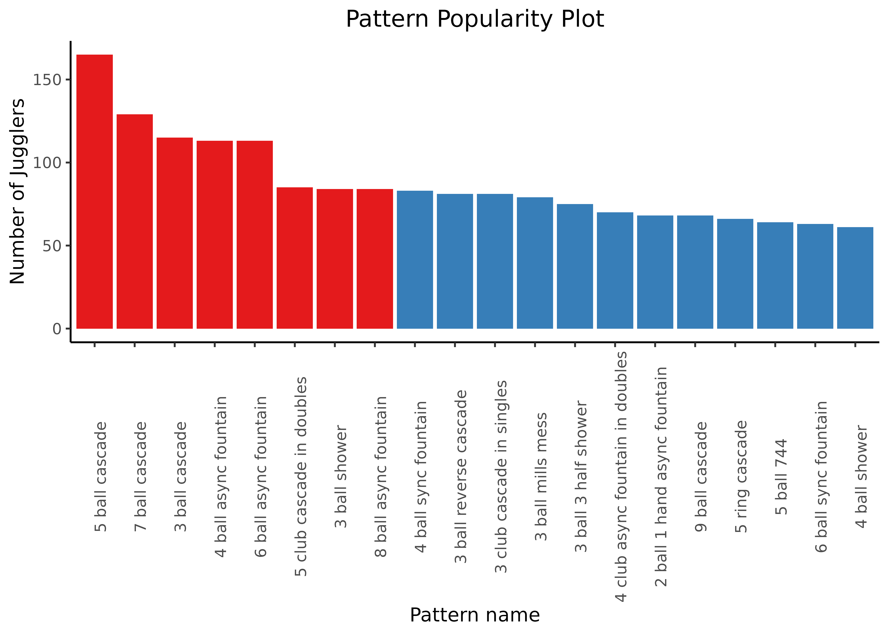
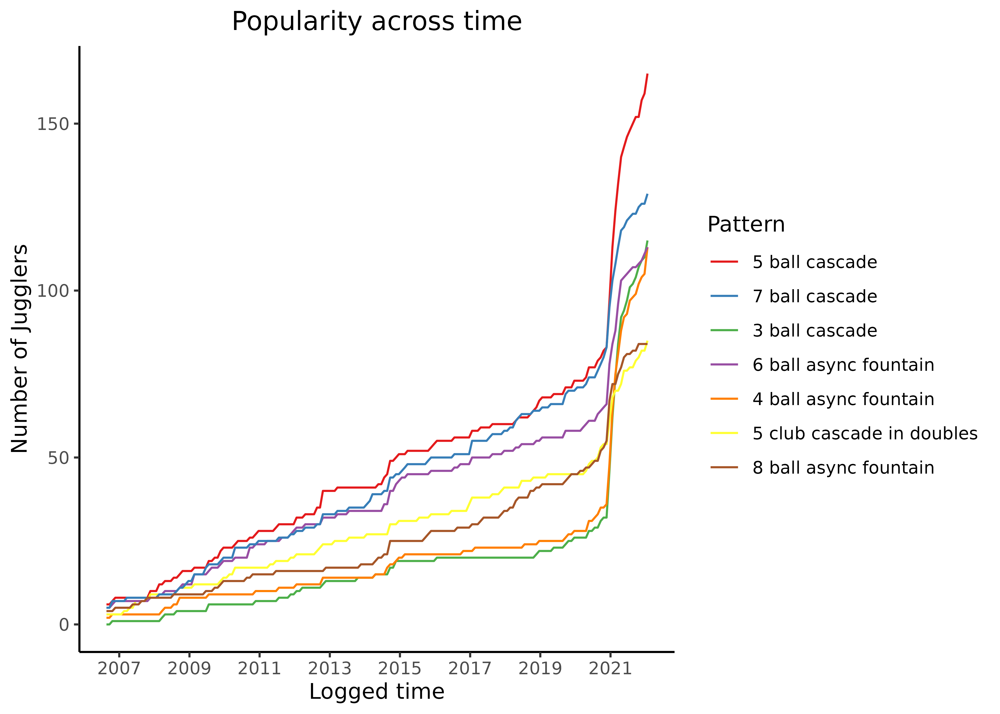

# juggling-records

Data was retrieved from https://juggling-records.com/res/backend/export_csv (**23/1/2022**) and analyzed using the `analysis.R` script to produce the figures below.

## Most popular patterns (Jan 2022)

Popularity here we mean higher number of jugglers have logged at least one record for a specific pattern.
The 8 most popular patterns are red-colored:

## Popularity trend

Now we take a closer look at the historical data for the 7 most popular patterns (skipping 3 ball shower which has the same number of jugglers as the 8 ball async fountain):

We observe linear increase in the number of jugglers logging patterns since the creation of the [juggling-records](https://www.juggling-records.com/) website, while around **Nov-Dec 2020** something happened that made the trend exponential!
